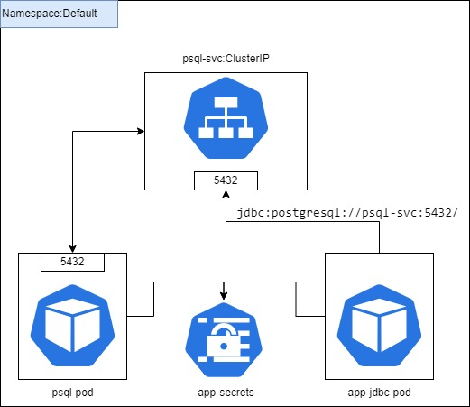

Exemplo para usar Service do tipo ClusterIP.

Criado um POD de banco de dados postgres com uma tabela default (psql/script.sql).

Criado um SERVICE do tipo ClusterIP para expor o pod na porta 5432.

Criado um APP java para acessar o banco de dados via DNS do service criado (jdbc:postgresql://psql-svc:5432/kubernetes).

